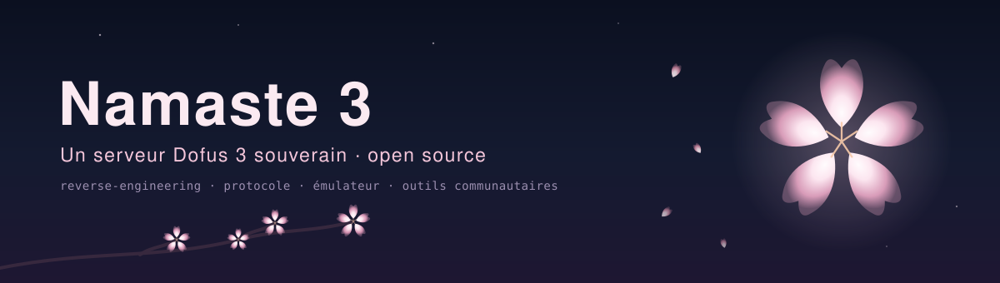

<p align="center">
  
</p>

<p align="center">
  <strong>Un serveur Dofus 3 souverain, et les outils pour y arriver.</strong><br>
  <em>A sovereign Dofus 3 server — and the tooling to get there.</em>
</p>

<p align="center">
  
  
  
  
</p>

---

## 🌸 Ce qu'on essaie de faire

Dofus 3 est un client **Unity / IL2CPP**. Son protocole est du **protobuf**, et chaque message porte
un nom **obfusqué de trois lettres** — `jru`, `kqp`, `hpd`. Pas de noms, pas de documentation.
Pire : ces noms sont **redistribués à chaque version majeure**.

La difficulté n'est donc pas de *comprendre* le jeu. Elle est de **retrouver le sens** de messages
qui n'en portent aucun.

Ce dépôt rassemble les outils qu'on écrit pour ça, et un serveur qu'on construit avec.
Tout est **déterministe** : ce qu'un script peut retrouver n'est jamais deviné.

> **Le client Dofus et ses données ne sont pas distribués ici.** Ni le dump du binaire, ni les
> sources décompilées, ni les cartes extraites. Ce dépôt ne contient que **notre code**.

---

## ✅ Ce qui marche (mesuré)

| Brique | État mesuré |
|---|---|
| **Dictionnaire de protocole** | 2 206 messages, 6 278 champs extraits ; sortie `.proto` régénérée par build |
| **Codec** (varint + protobuf sans schéma) | validé **octet par octet sur 355 trames réelles** · 71 tests |
| **Serveur de connexion** (.NET 8) | répond au vrai client officiel · 36 tests · **0 opcode écrit en dur** |
| **Extraction de cartes** | 17 353 cartes, 560 cellules chacune (l'outil est ici, pas la donnée) |
| **Chaîne de dump IL2CPP** | opérationnelle |
| **Gardes déterministes** | chacune éprouvée **dans les deux sens** (voir plus bas) |

---

## ❌ Ce qui ne marche pas encore — et pourquoi

C'est la section la plus utile du dépôt. On préfère un mur nommé à une promesse.

**🔴 Le client n'entre pas encore en jeu.**
Huit messages du chemin critique restent sans nom : `mgq`, `mgt`, `hpd`, `krs`, `kqp`, `ksl`,
`krt`, `hjk`. Sans eux, la séquence d'entrée est incomplète.

**Pourquoi l'analyse statique ne les donnera pas.** Mesuré : **0 message sur 2 206** ne porte de nom
clair récupérable statiquement. Le nom n'est pas caché dans le binaire — *il n'y est pas*. Le
statique donne la **forme** (structure, types, cardinalités), seule la **capture** donne le **sens**.

**Pourquoi les tables d'autres projets ne les donnent pas non plus.** On a testé les tables
d'opcodes de dépôts tiers contre les nôtres. Sur **596 opcodes comparables : 0 accord, 51
contradictions.** Les noms sont entièrement réassignés entre versions majeures. S'y fier aurait
produit 51 messages faux — du protobuf *valide*, donc compilateur muet, tests verts, et panne
visible seulement à l'écran.

**La bonne nouvelle symétrique** : entre deux versions *voisines* (3.6.10.10 → 3.6.10.11), la
rotation est **nulle sur 2 169 identités**. Un correctif ne casse rien ; c'est le saut majeur qui coûte.

> **Pourquoi ce dépôt cible 3.6.10.10 précisément** : c'est la version que fait tourner notre serveur.
> `3.6.10.10` et `3.6.10.11` sont **le même binaire** — sha256 identique sur `GameAssembly.dll` et
> `global-metadata.dat` — donc ce n'est pas une limitation : ce qui marche ici marche aussi sur
> `3.6.10.11`, et ne sera pas périmé à la prochaine build tant que le binaire ne bouge pas vraiment.

**Vous voulez obtenir cette build précise (ou une autre, ancienne) au lieu de celle du jour ?** Voir
[docs/OBTENIR-LE-CLIENT.md](docs/OBTENIR-LE-CLIENT.md) — le launcher officiel ne sert que la version
du jour, et la méthode pour remonter à une build ancienne y est expliquée.

**Autres limites connues :**
- La décompilation native (Ghidra) est **cassée** chez nous : le pré-script de typage ne s'exécute
  pas, l'export produit **0 fichier**. Signalé, pas caché.
- **Pas encore de patch client ni de launcher** : sans eux, le client officiel ne sait pas venir
  nous parler.
- La chaîne d'authentification (HAAPI / Zaap) n'est pas encore publiée ici.

---

## 🧭 La méthode — DARCI

**D**eterminist **A**ugments **R**eality through **C**ausal **I**ntelligence.
Pas un modèle, pas un chatbot : une **méthode**, posée sur un graphe, parcourue dans deux sens.

- **DAR** — *Découverte par Agrégation Resserrée*, la face **montante**. Des données brutes on
  agrège, on resserre, et **la bonne question émerge**.
- **MCI** — *Model of Causal Intelligence*, la face **descendante**. D'une question on rend une
  réponse **avec sa chaîne de causes** : version → message → classe → champ → ligne de source.

> **Une réponse sans chaîne de causes n'est pas une réponse, c'est une supposition — et elle se
> déclare comme telle.**

Concrètement, dans ce dépôt :
- une correspondance est marquée **DÉDUITE** tant qu'elle n'a pas été confrontée à la source ; elle
  ne devient un **fait** qu'après ;
- le **traçable** prime sur le probable ;
- chaque outil rend ses résultats **avec la commande qui les a produits** — rejouables, contestables.

### La discipline de preuve : éprouver dans les deux sens

Un vérificateur qu'on n'a **jamais vu échouer** ne prouve rien. Chaque garde de ce dépôt possède un
mode `--epreuve` qui lui **plante volontairement un défaut** et exige qu'elle le voie (témoin
positif), puis vérifie qu'elle laisse passer le cas sain (témoin négatif).

C'est la règle qui nous a le plus servi. Elle a attrapé, chez nous, des verts qui ne mesuraient rien.

---

## 📁 Organisation

```
tools/      nos outils : dump, cartographie, correspondance, chaîne d'analyse
protocol/   proto-sync (reconstruction du protocole) + tables d'opcodes
codec/      le codec varint + protobuf sans schéma (+ tests)
server/     le serveur de connexion .NET 8 (+ tests, docs)
docs/       la méthode, en détail
```

Les chemins cités dans les tables générées sont **relatifs** (`sources/...`) : ils désignent
l'arborescence du client décompilé chez vous, pas une machine en particulier.

---

## 🤝 Crédits

Ce projet se tient sur les épaules d'autres. Voir **[CREDITS.md](CREDITS.md)** — chaque outil et
chaque dépôt qui nous a servi y est cité avec ce qu'il nous a apporté, en particulier **JondoEmu**
de Keka, qui a prouvé que la chaîne complète était faisable.

Le jeu **Dofus** appartient à **Ankama**. Ce projet est technique et communautaire, sans marque
détournée ni ambition commerciale.

---

## 🌸 English summary

Dofus 3 uses Unity/IL2CPP with a **protobuf** protocol whose message names are **obfuscated
three-letter codes**, reshuffled at every major build. The hard part isn't understanding the game —
it's **recovering meaning** from messages that carry none.

**What works:** protocol dictionary (2 206 messages / 6 278 fields), a byte-exact codec validated on
355 real frames, a .NET 8 connection server answering the real client (36 tests, zero hardcoded
opcodes), map geometry extraction, and deterministic gates.

**What doesn't:** the client does not enter the game yet — 8 critical-path opcodes remain unnamed.
Static analysis cannot name them (measured: 0 of 2 206 messages carries a clear name statically);
only live capture can. Third-party opcode tables don't transfer either: **0 agreement and 51
contradictions across 596 comparable opcodes**, because names are fully reassigned between major
builds. Between *adjacent* builds, rotation is **zero across 2 169 identities**.

**Method — DARCI:** every answer ships with its causal chain (version → message → class → field →
source line). Anything not confronted with the source is marked **DEDUCED**, never a fact. Every
guard has a two-way proof: we sabotage it on purpose and require it to catch the defect.

**No Dofus client, binary dump, or extracted game data is distributed here — only our own code.**
Dofus is the property of Ankama.
